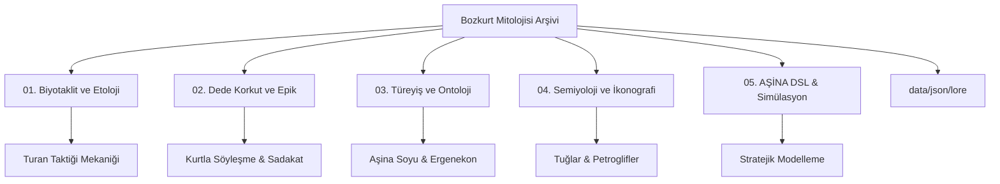

# 🐺 Bozkurt Mitolojisi: Biyotaklit, Hareket Felsefesi ve Kurt Sembolizmi Arşivi


[](https://creativecommons.org/licenses/by-nc-sa/4.0/)
[]()
[]()
[]()

> *"Yukarıda mavi gök, aşağıda yağız yer yaratıldığında, ikisinin arasında insan oğlu yaratılmış... O zamanlar Tanrı güç verdiği için, babam kağanın ordusu kurt gibi imiş, düşmanları koyun gibi imiş."* – *Orhun Yazıtları (Kül Tigin Anıtı)*

## 👁️ Giriş: Bozkırın Ontolojik Devinimi

Bu arşiv; Orta Asya bozkır kültürünün ontolojik temeli olan **Kurt (Böri / Aşina)** figürünü, basit bir mitolojik unsurun ötesinde, erken dönem bir **biyotaklit (biomimicry)**, sistem modellemesi ve asimetrik harp stratejisi vakası olarak inceleyen disiplinlerarası bir referans kütüphanesidir.

---

## ✨ Özgün Teknoloji Paradigması: Batı-Merkezli Teknolojiye Alternatif

Mevcut teknolojik ekosistem, büyük ölçüde Avrupa-merkezli (Western-centric) bir üretim sürecinin ve buna bağlı bir ontolojinin ürünüdür. Bu durum, teknolojinin sadece işleyişini değil, aynı zamanda düşünce biçimini ve problem çözme algoritmalarını da Batılı metaforlarla sınırlandırmıştır. 

**Bozkurt Mitolojisi Projesi**, bu tek tipleşmeye karşı bir **"Teknolojik Egemenlik"** ve **"Kültürel Ontoloji"** önerisidir. Hedefimiz; teknolojiyi sadece tüketmek değil, onu kendi kültürümüzden, tarihimizden ve kadim bozkır mantığımızdan süzülen bir bakış açısıyla yeniden üretmektir.

*   **Bozkır Ontolojisi**: Merkeziyetçi yapılar yerine, dağıtık (distributed) ve otonom (autonomous) sistemleri esas alır.
*   **Kut ve Tüz**: Teknolojiyi sadece mekanik bir araç olarak değil, "Kut" (meşruiyet ve verim) ve "Tüz" (evrensel denge ve hukuk) kavramlarıyla entegre bir sistem olarak modeller.
*   **AŞİNA Vizyonu**: Yazılım dillerini ve algoritmaları, Batılı mantık kalıplarından kurtarıp; bozkırın stratejik dehası (Turan Taktiği, Sürü Zekası) ile yeniden kodlamayı amaçlar.

Bu proje, "bizim olanı" teknolojiyle buluşturmak değil; **teknolojinin bizzat kendisini "bizim olan" bir bakış açısıyla inşa etme** çabasıdır.

---

Bozkırın zorlu coğrafyası, hayatta kalmayı mutlak bir adaptasyon yeteneğine bağlamıştır. Kadim Türkler, *Canis lupus* türünün sosyal hiyerarşisini, avlanma disiplinini ve çevreyle olan enerji alışverişini gözlemleyerek; bu gözlemleri kendi askeri, sosyolojik ve idari yapılarının çekirdeğine yerleştirmişlerdir. Bu proje, söz konusu tarihsel mirası modern veri bilimi ve simülasyon teknikleriyle yeniden anlamlandırmayı hedefler.

---

## 🔬 Etolojik Temeller ve Biyotaklit (Biomimicry)

Kurt, bozkır medeniyetleri için romantik bir sembolden ziyade, ampirik bir optimizasyon modelidir.

1.  **Sürü Zekası (Swarm AI)**: Kurtların dağıtık iletişim ağı, merkezi olmayan liderlik (Alfa-Beta hiyerarşisi) ve eşzamanlı manevra kabiliyeti, Türk ordu teşkilatının temeli olan "Tümen" yapısını ve dağıtık haberleşme ağlarını beslemiştir.
2.  **Enerji Optimizasyonu**: Kurtlar, avlarını takip ederken minimum enerjiyle maksimum verim almayı hedefler. Bozkır göçebeliğindeki "sürekli devinim" ve "lojistik hafiflik" bu modelden tevarüs etmiştir.
3.  **Asimetrik Harp (Turan Taktiği)**: Kurtların avı kuşatıp, sahte bir geri çekilmeyle pusuya çekme davranışı, tarihin en etkili askeri manevralarından biri olan Hilal Taktiği'ne (Wolf Trap) ilham vermiştir.

---

## 🧭 Depo Mimarisi ve Gezinti



---

## 📂 Bölüm Detayları

### 🛡️ [01. Biyotaklit ve Etolojik Strateji](01-biyotaklit-ve-etolojik-strateji/)
*   **Sürekli Devinim:** Nomadizm ve sistem optimizasyonu.
*   **Sürü Zekası:** Dağıtık iletişim ağları ve hiyerarşik esneklik.
*   **Asimetrik Harp:** Turan Taktiği'nin etolojik kökenleri ve mekaniği.

### 📜 [02. Dede Korkut Anlatıları ve Epik Gelenek](02-dede-korkut-anlatilari/)
*   **Kurt Yüzü Mübarektir:** Kurdun kutsallığının ontolojik analizi.
*   **Doğa-İnsan Simbiyozu:** Salur Kazan'ın kurtla söyleşmesi ve epik bağ.
*   **Toplumsal Hafıza:** Şamanik mirasın edebi metinlerdeki iz düşümleri.

### 🧬 [03. Türeyiş ve Ontoloji](03-tureyis-ve-ontoloji/)
*   **Aşina (Ašina) Boyu:** Göktürk hanedanının ilahi kurt soyuna dayanan meşruiyet zemini.
*   **Ergenekon Algoritması:** Bir topluluğun yok oluştan yeniden doğuşuna (scalability) giden lojistik süreç.
*   **Gökbörü Rehberliği:** Oğuz Kağan Destanı'nda navigasyonel bir unsur olarak "Işık ve Kurt".

### 🖼️ [04. Semiyoloji ve İkonografi](04-semiyoloji-ve-ikonografi/)
*   **Altın Kurt Başlı Tuğlar:** Bağımsızlık ve devlet otoritesinin semiyotik dili.
*   **Nümismatik ve Petroglifler:** Maddi kültür varlıklarındaki görsel süreklilik.

---

## 🐺 AŞİNA Dili ve Sözdizimi (Syntax) 2.1

`AŞİNA`, bozkır stratejilerini profesyonel bir nizam ile dijital ortama aktaran, alan özgü bir dildir (DSL).

### Temel Komut Seti

| Komut | Açıklama | Parametreler |
| :--- | :--- | :--- |
| `SÜRÜ` | Simülasyon bloğunu başlatır. | `"[Başlık]"` |
| `NİZAM` | Sistem yapılandırmasını tanımlar. | `GENİŞLİK`, `STRATEJİ`, `HAVA_DURUMU` |
| `DİZİLİŞ` | Sürü formasyonunu belirler. | `HİLAL`, `KISKAC`, `KAMA` |
| `ZEMİN` | Arazi tipini ve hız çarpanını belirler. | `BOZKIR`, `ORMAN`, `DAG` |
| `ROL` | Birimlere özel yetkinlik atar. | `[ID] [ALFA / ÖNCÜ / PUSUCU]` |
| `BÖRÜ` | Aktif kurt birimi sayısı. | `[n]` |
| `AV` | Hedef (prey) birimi sayısı. | `[n]` |
| `PUSU` | Pusuda bekleme yarıçapı. | `[Mesafe]` |
| `ÇAĞRI` | Log ve iletişim verisi. | `"[Mesaj]"` |
| `SON` | Betik dosyasını sonlandırır. | - |

### Stratejik Senaryo Örneği (v2.1)
```uluy
SÜRÜ "Karanlık Ormanda Kıskaç Harekatı"

NİZAM STRATEJİ KISKAC
ZEMİN ORMAN
NİZAM HAVA_DURUMU ACIK

BÖRÜ 10
AV 40

# Roller ve Liderlik
ROL 0 ALFA
ROL 1 ÖNCÜ
ROL 2 ÖNCÜ

PUSU 6
MÜDDET 500

ÇAĞRI "Ay doğdu, kurtlar pusuda. Kıskaç nizamına geçiliyor."
SON
```

---

## ⚙️ Simülasyon Mekanikleri ve Karar Destek

AŞİNA motoru, aşağıdaki dinamik değişkenleri işleyerek stratejik çıktılar üretir:

*   **Hava Durumu Modeli**: `KAR` ve `FIRTINA` durumlarında hareket hızı düşer, enerji tüketimi artar.
*   **Arazi (Zemin) Etkisi**: `DAG` arazisinde dikey engel çarpanı devreye girer. `ORMAN` arazisi `PUSU` başarısını artırırken görüşü kısıtlar.
*   **Enerji Yönetimi**: Hareket eden her birim enerji kaybeder. `AV` başarılı olduğunda `BÖRÜ` birimleri enerji tazeler. Enerjisi biten birim sürüden ayrılır (terminasyon).

---

## 📖 Börülük Sözlüğü (Glossary)

*   **Aşina (Ašina)**: Göktürk hanedanının efsanevi kurt soyu.
*   **Gökbörü**: İlahi ve stratejik rehber kurt.
*   **Turan Taktiği**: Kuşatma ve sahte geri çekilme algoritması.
*   **Yelme**: Keşif ve yıpratma saldırıları yapan öncü kurt birimi.
*   **Tüz**: Evrensel denge, nizam ve kadim töre.

---

## 🚀 Yol Haritası (Roadmap)

- [x] **AŞİNA v2.1 Engine**: Formasyon ve rol tabanlı strateji motoru.
*   [x] **Advanced ASCII Rendering**: Dinamik arazi ve birim görselleştirmesi.
- [x] **Lore Integration**: JSON tabanlı destan verilerinin simülasyonla eşleşmesi.
*   [ ] **Genetic Optimization**: Nesiller arası başarılı stratejilerin evrimi.
- [ ] **Interactive Web Dashboard**: Canlı AŞİNA betik editörü ve simülatörü.

---

## 📄 Lisans ve Katkıda Bulunma

Bu proje **CC BY-NC-SA 4.0** lisansı altındadır. Akademik çalışmalar için kaynak gösterilmesi zorunludur.

**"Böri tegi erdemlik"**
*(Kurt gibi erdemli, otonom ve kararlı)*