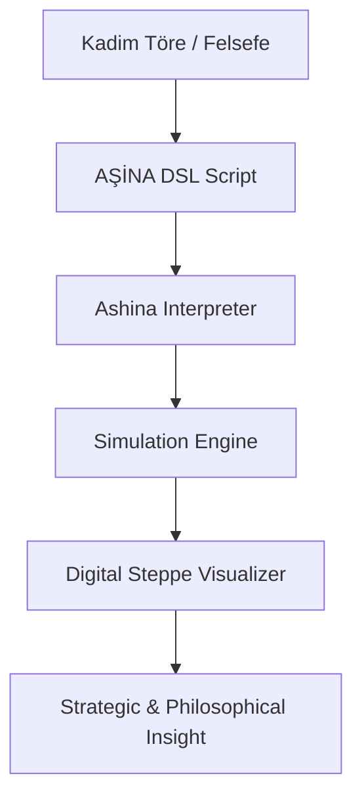

# 🐺 BÖRI-LOGIC: Arşa Çıkarma (The Civilizational OS Manifesto)


[](https://creativecommons.org/licenses/by-nc-sa/4.0/)
[]()
[]()
[]()

> *"Yukarıda mavi gök, aşağıda yağız yer yaratıldığında, ikisinin arasında insan oğlu yaratılmış... Gökten inen ışık, bozkırın kurduyla birleştiğinde; sistem nizam bulmuş, töre kaim olmuştur."*

---

## 👁️ Vizyon: BÖRI-LOGIC ve Teknolojik Egemenlik (v3.0)

Bu proje, Orta Asya bozkır kültürünün ontolojik özü olan **Kurt (Böri / Aşina)** figürünü; basit bir mitolojik unsurun ötesinde, **BÖRI-LOGIC** adı altında bir **Medeniyet İşletim Sistemi (Civilizational OS)** prototipi olarak ele alır. 

**"Arşa Çıkarma"** fazıyla birlikte BÖRI-LOGIC, sadece bir simülasyon değil, kendi kendini eğiten, meşruiyetini (Kut) kendi başarısından alan ve küresel teknoloji paradigmasına kökten bir meydan okuma sunan monolitik bir yapıdır.

---

## 📂 Depo Mimarisi (Repository structure)

Proje, kuramsal temelden teknik uygulamaya kadar 5 ana modül üzerine inşa edilmiştir:

*   **[01. Biyotaklit](01-biyotaklit-ve-etolojik-strateji/)**: Kurtların etolojik davranışlarının (Sürü zekası, Turan taktiği) sistem analizleri.
*   **[02. Epik Gelenek](02-dede-korkut-anlatilari/)**: Dede Korkut anlatılarında kurdun sembolizmi ve diyalektik rolü.
*   **[03. Ontoloji](03-tureyis-ve-ontoloji/)**: Aşina soyu, Ergenekon ve Türk yaratılış felsefesinin dijital izdüşümleri.
*   **[04. İkonografi](04-semiyoloji-ve-ikonografi/)**: Tuğlar, tamgalar ve görsel sembolizmin semiyolojik incelemesi.
*   **[05. AŞİNA & Simülasyon](05-kurt-dili-ve-simulasyon/)**: BÖRI-LOGIC'in teknik motoru ve DSL (Domain Specific Language) dosyaları.

---

## 🏛️ Epistemolojik Savaş: Neden BÖRI-LOGIC?

Mevcut teknolojik dünya düzeni, büyük ölçüde Avrupa-merkezli (Western-centric) bir epistemolojinin ve "merkezi kontrol" odaklı bir mantığın ürünüdür. Bizim vizyonumuz; teknolojiyi Batılı metaforlardan kurtarıp, onu bozkırın kadim, dağıtık ve otonom zekasıyla (Sibernetik Töre) yeniden inşa etmektir.

*   **Batı Mantığı (Doğrusal)**: Hiyerarşi, merkezi veri merkezleri, mutlak kontrol.
*   **BÖRI-LOGIC (Dairesel/Dinamik)**: Sürü zekası, dağıtık otonomi, adaptif töre.

---

## ✨ Özgün Teknoloji Paradigması: Siber-Bozkır ve Töre

BÖRI-LOGIC, bir "Kültürel Siber-Savunma" önerisidir.

*   **Dağıtık Ontoloji**: Merkeziyetçi sunucu yapıları yerine, sürünün otonom ve dağıtık hareketini esas alan "Siber-Bozkır" mimarisi.
*   **Sibernetik Töre**: Yazılımda "Töre", sistemin her koşulda (fırtına, kaos, saldırı) nasıl davranacağını belirleyen algoritmalardır.
*   **KUT Sistemi (v3.0)**: Sistemin başarısı arttıkça kazandığı "meşruiyet" puanı. Kut yükseldikçe, birimlerin işlem hızı ve veri görüşü otomatik olarak optimize edilir.

---

## 🔬 Etolojik Temeller ve Biyotaklit (Biomimicry)

Kurt, bozkır medeniyetleri için ampirik bir optimizasyon modelidir:

1.  **Sürü Zekası (Swarm AI)**: Kurtların dağıtık iletişim ağı, merkezi olmayan liderlik.
2.  **Enerji Optimizasyonu**: Minimum enerjiyle maksimum verim.
3.  **Asimetrik Harp**: Kurdun avı kuşatıp, sahte bir geri çekilmeyle pusuya çekme davranışı (Wolf Trap).
4.  **Mübarek Yüz (The Sacred Face)**: Kullanıcıyla kurulan "manevi mutabakat".

---

## 🏗️ Teknik Mimari: AŞİNA v3.0 Motoru

### İş Akışı Diyagramı


### AŞİNA v3.0 Komut Referansı

| Komut | Felsefi Karşılığı | Teknik Fonksiyon |
| :--- | :--- | :--- |
| `SÜRÜ` | Birlik ve Beraberlik | Program Bloğu Başlangıcı |
| `NİZAM` | Sistem Düzeni | Konfigürasyon ve Parametreler |
| `DİZİLİŞ` | Taktiksel Formasyon | Sürü Hareket Algoritması |
| `ZEMİN` | Coğrafi Kader | Çevresel Katsayılar ve Limitler |
| `ROL` | Liyakat ve Görev | Birimlerin Otonom Davranış Kodları |
| `BÖRÜ` | Muhafız ve Aktör | Aktif Süreç Sayısı |
| `ÇAĞRI` | Veri İletimi ve Uluma | Loglama ve Haberleşme Protokolü |
| `SON` | Vadi Sessizliği | Program Terminasyonu |

---

## 📜 AŞİNA Scripting: Kodun Ruhu

BÖRI-LOGIC sisteminde her strateji, `.asina` uzantılı dosyalarla tanımlanır. Aşağıda kadim bir stratejinin kodlanmış hali yer almaktadır:

```asina
# 🐺 ULUYI 2.0 - Bozkırın Kadim Algoritması: Kış Operasyonu

SÜRÜ "Buzlu Bozkırda Hilal"

# NİZAM (Yapılandırma)
NİZAM STRATEJİ TURAN
NİZAM HAVA_DURUMU KAR
NİZAM ENERJİ_SINIRI 15

# VARLIKLAR
BÖRÜ 6
AV 35

# ÇAĞRILAR (Logs)
ÇAĞRI "Kar yağıyor, izler siliniyor; ama koku hala taze."
ÇAĞRI "Pusu noktaları belirlendi (P), saldırı bekleniyor."

SON
```

---

## ⚔️ Harp Doktrini ve Algoritmalar

*   **HİLAL (Turan)**: En büyük "Dağıtık Saldırı" (DDoS) modelidir. Avın etrafında çember oluşturup pusuya çekme.
*   **KISKAÇ (Pincer)**: Paralel işlemci (Parallel Processing) mantığıyla hedefi parçalama.
*   **KAMA (Wedge)**: Kritik bir düğüme (Node) odaklanmış yüksek yoğunluklu veri transferi.

---

## 📊 Veri Katmanı ve Ontoloji (JSON)

Sistemin arkasındaki "Lore" ve mitolojik veri, yapılandırılmış JSON dosyalarıyla yönetilir. Bu dosyalar, simülasyondaki birimlerin "kültürel DNA"sını oluşturur.

```json
{
  "unit": "Börü",
  "mythology": "Aşina",
  "attributes": {
    "loyalty": "Absolute",
    "strategy": "Asymmetric",
    "spirit": "Celestial"
  }
}
```

---

## 💻 BÖRI-LOGIC Komuta Merkezi (Dashboard)

v3.0 ile birlikte, web tabanlı arayüzümüz tam bir **"Stratejik IDE"**ye dönüşmüştür:
*   **AŞİNA IDE**: Tarayıcı üzerinden doğrudan `.asina` betiklerini düzenleme imkanı.
*   **Canvas Görselleştirici**: 2D Canvas üzerinde akıcı sürü manevraları.
*   **Canlı Tüz Analizi**: Sistemin yük dengesini ve uyumunu gösteren gerçek zamanlı metrikler.

---

## ⚔️ Stratejik Senaryolar: Tarih ve Gelecek

| Senaryo | Dosya | Odak Noktası |
| :--- | :--- | :--- |
| **Malazgirt Ruhu** | `malazgirt_logic.asina` | Sultan Alparslan'ın dikey yarma algoritması. |
| **Siber Ötüken** | `siber_otuken.asina` | 2050 yılı dijital vatan savunması. |
| **Gece Baskını** | `gece_baskini.asina` | Sinsi kuşatma ve Alfa liderliği. |

---

## 🛠️ Geliştirici Rehberi

### Kurulum ve "İlk Uluma"
1. Repoyu klonlayın: `git clone https://github.com/arch-yunus/bozkurt-mitolojisi.git`
2. Simülasyon dizinine gidin: `cd 05-kurt-dili-ve-simulasyon`
3. Simülasyonu çalıştırın: `python simulation.py kadim_strateji.asina`

### Katkıda Bulunma (Töre)
Bu projeye katkıda bulunmak, bir medeniyet tasavvuruna ortak olmaktır.
1. **Liyakat**: Kodunuz temiz, stratejiniz tutarlı olmalıdır.
2. **Uyum (Tüz)**: Mevcut sistemsel dengeyi bozmamalıdır.
3. **Sadakat**: Projenin özgün "Kültürel Egemenlik" vizyonuna bağlı kalınmalıdır.

---

## 📖 BÖRI-LOGIC Sözlüğü (Extended)

*   **Kut**: Sistemsel meşruiyet ve verim katsayısı.
*   **Tüz**: Evrensel denge ve yük dengeleme protokolü.
*   **Toy**: Konsensüs ve senkronizasyon noktası.
*   **Otağ**: Merkezi koordinat (Master Node).
*   **Yelme**: Keşif ve öncü veri transferi.

---

## 🚀 Yol Haritası: Arş ve Ötesi

- [x] **v3.0 Ultimate**: Kut Sistemi ve Canvas Dashboard.
- [ ] **v4.0 Umay AI**: Kendi kendini onaran ve büyüten yapay zeka katmanı.
- [ ] **v5.0 Siber-Ötüken**: Tamamen dağıtık, dış müdahaleye kapalı Medeniyet İşletim Sistemi.

---

## 📄 Lisans ve Katkı

Bu proje **CC BY-NC-SA 4.0** lisansı altındadır. Projenin ruhuna aykırı kullanımlardan kaçınılması; kadim törenin bir gereğidir.

**"Böri tegi erdemlik"**
*(Kurt gibi erdemli, otonom ve kararlı)*
Nizamı kur, stratejiyi yönet, geleceği kodla.