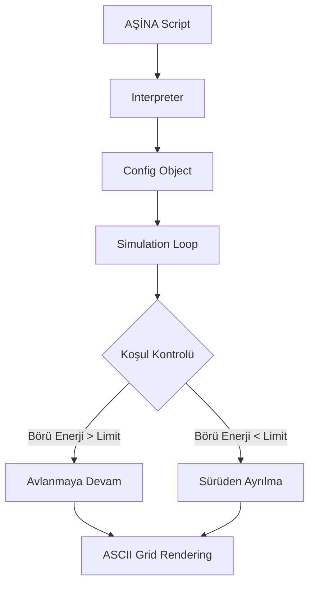

# 🐺 BÖRI-LOGIC: Biyotaklit, Sibernetik Töre ve Özgün Teknoloji Manifestosu


[](https://creativecommons.org/licenses/by-nc-sa/4.0/)
[]()
[]()
[]()

> *"Yukarıda mavi gök, aşağıda yağız yer yaratıldığında, ikisinin arasında insan oğlu yaratılmış... Gökten inen ışık, bozkırın kurduyla birleştiğinde; sistem nizam bulmuş, töre kaim olmuştur."*

---

## 👁️ Vizyon: BÖRI-LOGIC ve Dijital Bozkır

Bu proje, Orta Asya bozkır kültürünün ontolojik özü olan **Kurt (Böri / Aşina)** figürünü; basit bir mitolojik unsurun ötesinde, **BÖRI-LOGIC** adı altında bir **Medeniyet İşletim Sistemi (Civilizational OS)** prototipi olarak ele alır. 

**BÖRI-LOGIC**, Avrupa-merkezli (Western-centric) teknoloji paradigmasına karşı geliştirilmiş bir **"Teknolojik Egemenlik"** önerisidir. Hedefimiz; teknolojiyi sadece tüketmek değil, onu kendi kültürümüzden, tarihimizden ve kadim bozkır mantığımızdan süzülen bir bakış açısıyla yeniden üretmektir.

---

## ✨ Özgün Teknoloji Paradigması ve Epistemolojik Başkaldırı

Teknoloji, sadece bir araç değil; üretildiği kültürün dünya görüşünü taşıyan bir "mantık kılıfıdır". Bugün kullandığımız algoritmalar, Silikon Vadisi veya Şenzen'in ontolojik tercihlerini (merkeziyetçilik, gözetim, doğrusal büyüme) dayatmaktadır.

**BÖRI-LOGIC**, bu dayatmaya karşı bir alternatif sunar:

1.  **Dağıtık Ontoloji (Siber-Bozkır)**: Bozkır, sınırsız ve merkezi olmayan bir alandır. Teknolojimiz de; tek bir sunucuya değil, "sürü" gibi hareket eden, her bir parçası otonom ama töreye (protokole) bağlı bir yapıdadır.
2.  **Sibernetik Töre**: Töre, bozkırda değişmez koddur. Yazılımda "Töre", sistemin her koşulda (fırtına, savaş, açlık) nasıl davranacağını belirleyen, esnemez ama adaptif algoritmalardır.
3.  **Kut ve Tüz**: Teknolojik sistemin meşruiyeti (Kut) ve iç dengesi (Tüz), Batılı "verimlilik" kavramının ötesinde, sistemin "etik sürekliliği" ile ölçülür.

---

## 🔬 Algoritmik Derinlik: Bozkırın Matematiksel Ruhu

BÖRI-LOGIC içerisinde kullanılan stratejiler, sadece görsel bir hareket değil, karmaşık birer matematiksel modeldir.

### 1. HİLAL (Asimetrik Kuşatma)
*   **Mantık**: Hedef birimin koordinatlarını merkez alarak, sürü birimlerinin radyal bir dağılımla (R-theta) çevrelenmesi.
*   **Optimizasyon**: Avın kaçış vektörleri analiz edilir ve sürü, bu vektörlerin en yüksek olasılıklı olduğu noktalarda yoğunlaşır.
*   **Kod Karşılığı**: `Wolf.hunt` metodunda, `dist_sq > ambush_range**2` koşuluyla pusu mekaniği tetiklenir.

### 2. KAMA (Merkezi Yarma)
*   **Mantık**: Alfa liderliğinde, en düşük direnç noktasından sisteme sızma.
*   **Mekanik**: Birimlerin enerjisi tek bir vektörde birleştirilir (Vector Aggregation).
*   **Bozkır Karşılığı**: Düşman hattını en zayıf noktasından parçalayıp moral ve lojistik bütünlüğü bozma.

---

## ⚔️ Harp Tarihi Karşılaştırmalı Analizi

BÖRI-LOGIC'in dayandığı stratejilerin, klasik Batı askeri mantığından farkı şöyledir:

| Özellik | Batı (Lineer/Statik) | BÖRI-LOGIC (Dağıtık/Dinamik) |
| :--- | :--- | :--- |
| **Komuta Yapısı** | Katı Hiyerarşi (Top-Down) | Otonom Birimler (Alfa-Beta Hiyerarşisi) |
| **Lojistik** | Merkezi Depolama (Silo) | Hareket Halinde Tedarik (Nomadik) |
| **Harp Alanı** | Belirli Sınırlar (Static Grid) | Sınırsız Bozkır (Fluid Simulation) |
| **Hata Toleransı** | Düşük (Merkez çökerse sistem çöker) | Yüksek (Her kurt bir liderdir) |
| **Metafor** | Satranç (Sınırlı hamleler) | Av (Sınırsız ihtimaller) |

---

## 🏗️ Teknik Mimari ve Simülasyon Fiziği

AŞİNA dilli simülasyon motoru, aşağıdaki fiziksel ve sistemsel kurallara göre çalışır:

### Enerji Ekonomisi Formülü
Sistemdeki her birim (`Entity`), her döngüde (`iteration`) şu formüle göre enerji kaybeder:
`Energy_Loss = Base_Rate * (Terrain_Multiplier + Weather_Penalty) * Movement_Vector`

*   **Zemin Çarpanı (`ZEMİN`)**: `DAG` (1.5x), `ORMAN` (1.2x), `BOZKIR` (1.0x).
*   **Hava Durumu (`NİZAM`)**: `FIRTINA` (2.0x), `KAR` (1.5x), `ACIK` (1.0x).

### İş Akışı Diyagramı


---

## 📜 AŞİNA v2.5 Dilbilgisi ve Sözdizimi Rehberi

AŞİNA, sadece komutlardan değil, bir "nizam"dan oluşur.

*   **Blok Başlatma**: Her dosya `SÜRÜ "[Başlık]"` ile başlamalıdır. Bu, sistem hafızasında (RAM) yeni bir "Bozkır" alanı açar.
*   **Nizam Tanımlama**: `NİZAM` komutları sistemin sabitlerini (Global Constants) belirler.
*   **Rol Atama**: `ROL` komutu, nesne tabanlı programlama (OOP) mantığıyla her birime farklı metodlar atar.
*   **Terminasyon**: `SON` komutu, tüm açık soketleri kapatır ve simülasyonu güvenli bir şekilde bitirir.

---

## 🏔️ Gelecek Vizyonu: 2050 ve Siber-Ötüken

BÖRI-LOGIC, kısa vadeli bir yazılım projesi değil, uzun vadeli bir medeniyet inşasıdır:

1.  **AŞİNA 3.0: KUT Protokolü**: Sistemsel meşruiyetin blockchain tabanlı doğrulanması.
2.  **AŞİNA 4.0: UMAY AI**: Kendi kendini onaran (self-healing), besleyici ve koruyucu bir yapay zeka katmanı.
3.  **AŞİNA 5.0: SİBER-ÖTÜKEN**: Tüm toplumsal ve teknik verilerin, kadim töre algoritmalarıyla korunduğu, dış müdahalelere kapalı, kültürel-teknolojik bir "Güvenli Bölge".

---

## 🛠️ Geliştirici ve Katkıda Bulunma Rehberi

### Kurulum
```bash
git clone https://github.com/arch-yunus/BORI-LOGIC.git
cd BORI-LOGIC/05-kurt-dili-ve-simulasyon
python simulation.py kadim_strateji.asina
```

### Katkı İlkeleri (Töreye Bağlılık)
*   **Özgünlük**: Batılı kütüphane ve mantıklara bağımlılığı minimize edin.
*   **Sembolizm**: Kod içerisindeki değişken isimlerinde kültürel terminolojiye sadık kalın.
*   **Erdemlik**: Yazdığınız kodun sistemin "Tüz"üne (dengesine) zarar vermediğinden emin olun.

---

## 📖 Genişletilmiş BÖRI-LOGIC Sözlüğü

*   **Aşina**: Kurucu mantık, kök dizin.
*   **Börü**: İşlemci (Processor), aktif birim.
*   **Av**: Veri (Data), hedef birim.
*   **Töre**: Algoritma, protokol.
*   **Toy**: Consensus, senkronizasyon noktası.
*   **Kut**: Legitimacy, sistem başarısı.
*   **Tüz**: Load Balancing, sistem dengesi.

---

## 📄 Lisans ve Etik Bildirim

Bu arşiv **CC BY-NC-SA 4.0** lisansı altındadır. Projenin ruhuna aykırı, merkeziyetçi, gözetim odaklı ve etik dışı kullanımlar "Töre"ye aykırı kabul edilir.

<br>
<p align="center">
  <b>"Böri tegi erdemlik"</b><br>
  <i>(Kurt gibi erdemli, otonom ve kararlı)</i><br>
  Nizamı kur, stratejiyi yönet, geleceği kodla.
</p>