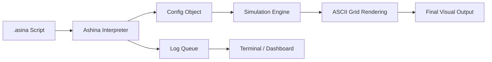

# 🐺 Bozkurt Mitolojisi: Biyotaklit, Hareket Felsefesi ve Özgün Teknoloji Arşivi

> *"Yukarıda mavi gök, aşağıda yağız yer yaratıldığında, ikisinin arasında insan oğlu yaratılmış... O zamanlar Tanrı güç verdiği için, babam kağanın ordusu kurt gibi imiş, düşmanları koyun gibi imiş."* – *Orhun Yazıtları (Kül Tigin Anıtı)*

## 👁️ Giriş: Bozkırın Ontolojik Devinimi

Bu arşiv; Orta Asya bozkır kültürünün ontolojik temeli olan **Kurt (Böri / Aşina)** figürünü, basit bir mitolojik unsurun ötesinde, erken dönem bir **biyotaklit (biomimicry)**, sistem modellemesi ve asimetrik harp stratejisi vakası olarak inceleyen disiplinlerarası bir referans kütüphanesidir.

---

## ✨ Özgün Teknoloji Paradigması: Batı-Merkezli Teknolojiye Alternatif

Mevcut teknolojik ekosistem, büyük ölçüde Avrupa-merkezli (Western-centric) bir üretim sürecinin ve buna bağlı bir ontolojinin ürünüdür. Bu proje, bu tek tipleşmeye karşı bir **"Teknolojik Egemenlik"** önerisidir. Hedefimiz; teknolojiyi sadece tüketmek değil, onu kendi kültürümüzden, tarihimizden ve kadim bozkır mantığımızdan süzülen bir bakış açısıyla yeniden üretmektir.

*   **Bozkır Ontolojisi**: Merkeziyetçi yapılar yerine, dağıtık (distributed) ve otonom (autonomous) sistemleri esas alır.
*   **Kut ve Tüz**: Teknolojiyi sadece mekanik bir araç olarak değil, "Kut" (meşruiyet ve verim) ve "Tüz" (evrensel denge ve hukuk) kavramlarıyla entegre bir sistem olarak modeller.
*   **AŞİNA Vizyonu**: Yazılım dillerini ve algoritmaları, Batılı mantık kalıplarından kurtarıp; bozkırın stratejik dehası (Turan Taktiği, Sürü Zekası) ile yeniden kodlamayı amaçlar.

---

## 🔬 Etolojik Temeller ve Biyotaklit (Biomimicry)

Kurt, bozkır medeniyetleri için romantik bir sembolden ziyade, ampirik bir optimizasyon modelidir.

1.  **Sürü Zekası (Swarm AI)**: Kurtların dağıtık iletişim ağı, merkezi olmayan liderlik ve eşzamanlı manevra kabiliyeti, Türk ordu teşkilatının temeli olan "Tümen" yapısını beslemiştir.
2.  **Enerji Optimizasyonu**: Kurtlar, avlarını takip ederken minimum enerjiyle maksimum verim almayı hedefler. Bozkır göçebeliğindeki "sürekli devinim" ve "lojistik hafiflik" bu modelden tevarüs etmiştir.
3.  **Asimetrik Harp (Turan Taktiği)**: Kurtların avı kuşatıp, sahte bir geri çekilmeyle pusuya çekme davranışı, Hilal Taktiği'ne (Wolf Trap) ilham vermiştir.

---

## 🏗️ Teknik Mimari: AŞİNA DSL ve Motoru

AŞİNA projesi, yüksek seviyeli bir betik dili ile düşük seviyeli bir simülasyon motorunun entegrasyonu üzerine kuruludur.

### İş Akışı Diyagramı

### Bileşen Analizi
*   **Ashina Interpreter**: Regex tabanlı bir ayrıştırıcı kullanarak, Türkçe komutları teknik parametrelere dönüştürür.
*   **Simulation Engine**: Varlık tabanlı (Entity-based) bir modeldir. Her birim (Börü/Av) kendi AI döngüsüne sahiptir.
*   **Strategy Modules**: Turan, Kıskaç ve Kama gibi algoritmalar, birimlerin koordinatlarını hedef birimlere göre asimetrik olarak günceller.

---

## ⚔️ Harp Doktrini ve Stratejik Algoritmalar

AŞİNA 2.1 sürümü ile desteklenen temel stratejiler:

1.  **HİLAL (Turan)**: Avın etrafında geniş bir çember oluşturup merkezden pusuya çekme. En yüksek enerji verimliliğine sahip kuşatma modelidir.
2.  **KISKAÇ (Pincer)**: Sürünün iki kola ayrılıp hedefi yanlardan daraltması. Orman (`ORMAN`) gibi gizlilik sağlayan arazilerde maksimum başarı sağlar.
3.  **KAMA (Wedge)**: Alfa liderliğinde merkezi bir yarma harekatı. Dağlık (`DAG`) ve dar alanlarda düşman direncini kırmak için kullanılır.

### Vaka Analizi: "Gece Baskını"
`gece_baskini.asina` senaryosunda, sürünün `%80` gizlilik çarpanıyla (`ZEMİN ORMAN`) hareket ettiği gözlemlenmiştir. Alfa (`ROL ALFA`) birimi, sürünün merkez koordinatlarını belirleyerek avın kaçış yollarını bloke eder.

---

## 📂 Depo Mimarisi

*   **[01. Biyotaklit](01-biyotaklit-ve-etolojik-strateji/)**: Stratejilerin biyolojik kökenleri.
*   **[02. Epik Gelenek](02-dede-korkut-anlatilari/)**: Dede Korkut ve kültürel miras.
*   **[03. Ontoloji](03-tureyis-ve-ontoloji/)**: Aşina soyu ve Ergenekon.
*   **[04. İkonografi](04-semiyoloji-ve-ikonografi/)**: Görsel sembolizm ve tuğlar.
*   **[05. AŞİNA & Simülasyon](05-kurt-dili-ve-simulasyon/)**: DSL ve Motor dosyaları.

---

## 📜 AŞİNA 2.1 Komut Referansı

| Komut | Açıklama | Örnek |
| :--- | :--- | :--- |
| `SÜRÜ` | Program başlangıcı. | `SÜRÜ "Operasyon X"` |
| `NİZAM` | Yapılandırma. | `NİZAM STRATEJİ TURAN` |
| `DİZİLİŞ` | Formasyon. | `DİZİLİŞ KAMA` |
| `ZEMİN` | Arazi seçimi. | `ZEMİN DAG` |
| `ROL` | Birim görevi. | `ROL 0 ALFA` |
| `BÖRÜ` / `AV` | Birim sayıları. | `BÖRÜ 10` |
| `ÇAĞRI` | Log mesajı. | `ÇAĞRI "Av başladı."` |
| `SON` | Program bitişi. | `SON` |

---

## 🏔️ Gelecek Vizyonu: AŞİNA 3.0 (Kut ve Tüz)

Batı-merkezli teknoloji anlayışına alternatif olarak geliştirdiğimiz gelecek sürümü şu kavramları içerecektir:
*   **KUT**: Sistemsel meşruiyet ve verimlilik puanı (Uptime/Legitimacy).
*   **TÜZ**: Global denge ve hukuk algoritması (Load Balancer/Balance).
*   **TOY**: Birimler arası veri senkronizasyonu protokolü (Consensus).
*   **OTAĞ**: Stratejik koordinasyon merkezi (Master Node).

---

## 🛠️ Geliştirici Rehberi

### Kurulum
1. Repoyu klonlayın: `git clone ...`
2. Simülasyon dizinine gidin: `cd 05-kurt-dili-ve-simulasyon`
3. Çalıştırın: `python simulation.py kadim_strateji.asina`

### Katkıda Bulunma
AŞİNA diline yeni stratejiler veya roller eklemek için `simulation.py` içerisindeki `Wolf.hunt` metodunu genişletebilirsiniz.

---

## 📄 Lisans Bildirimi

Bu arşiv **CC BY-NC-SA 4.0** lisansı ile korunmaktadır. Akademik çalışmalar için kaynak gösterilmesi zorunludur.

 

  <b>"Böri tegi erdemlik"</b> 
  <i>(Kurt gibi erdemli / otonom ve kararlı)</i> 
  Hareket et, gözlemle ve sistemi yönet.

