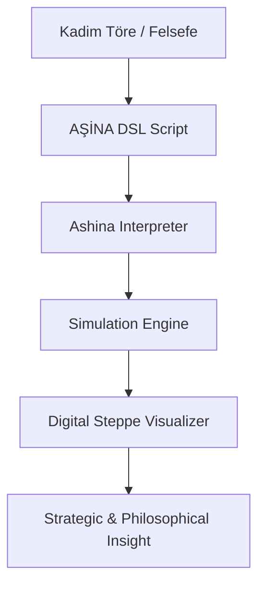

# 🐺 Bozkurt Mitolojisi: Biyotaklit, Sibernetik Töre ve Özgün Teknoloji Manifestosu

> *"Yukarıda mavi gök, aşağıda yağız yer yaratıldığında, ikisinin arasında insan oğlu yaratılmış... Gökten inen ışık, bozkırın kurduyla birleştiğinde; sistem nizam bulmuş, töre kaim olmuştur."*

---

## 👁️ Vizyon: Dijital Bozkır ve Sibernetik Töre

Bu proje, Orta Asya bozkır kültürünün ontolojik özü olan **Kurt (Böri / Aşina)** figürünü; basit bir mitolojik unsurun ötesinde, bir **Medeniyet İşletim Sistemi (Civilizational OS)** prototipi olarak ele alır. 

Mevcut teknolojik dünya düzeni, büyük ölçüde Avrupa-merkezli (Western-centric) bir epistemolojinin ve "merkezi kontrol" odaklı bir mantığın ürünüdür. Bizim vizyonumuz; teknolojiyi Batılı metaforlardan kurtarıp, onu bozkırın kadim, dağıtık ve otonom zekasıyla (Sibernetik Töre) yeniden inşa etmektir.

---

## ✨ Özgün Teknoloji Paradigması ve Epistemolojik Başkaldırı

Teknoloji, sadece bir araç değil; üretildiği kültürün dünya görüşünü taşıyan bir "mantık kılıfıdır". Bugün kullandığımız algoritmalar, Silikon Vadisi veya Şenzen'in ontolojik tercihlerini (merkeziyetçilik, gözetim, doğrusal büyüme) dayatmaktadır.

**Bozkurt Mitolojisi Projesi**, bu dayatmaya karşı bir **"Teknolojik Egemenlik"** önerisidir:

1.  **Dağıtık Ontoloji (Siber-Bozkır)**: Bozkır, sınırsız ve merkezi olmayan bir alandır. Teknolojimiz de; tek bir sunucuya değil, "sürü" gibi hareket eden, her bir parçası otonom ama töreye (protokole) bağlı bir yapıdadır.
2.  **Sibernetik Töre**: Töre, bozkırda değişmez koddur. Yazılımda "Töre", sistemin her koşulda (fırtına, savaş, açlık) nasıl davranacağını belirleyen, esnemez ama adaptif algoritmalardır.
3.  **Kut ve Tüz**: Teknolojik sistemin meşruiyeti (Kut) ve iç dengesi (Tüz), Batılı "verimlilik" (efficiency) kavramının ötesinde, sistemin "var olma amacı" ve "etik sürekliliği" ile ölçülür.

---

## 🔬 Etolojik Temeller ve Biyotaklit (Biomimicry)

Kurt, bozkır medeniyetleri için bir optimizasyon modelidir:

*   **Asimetrik Zeka**: Kurdun avlanma stratejisi, tarihin ilk "hata payı yüksek ama başarı odaklı" (probabilistic) algoritmasıdır.
*   **Lojistik Hafiflik**: Nomadizm, veriyi ve gücü sabit bir noktada (storage) tutmak yerine, hareket halindeki birimlere (edge computing) dağıtmayı öğretir.
*   **Mübarek Yüz (The Sacred Face)**: Teknoloji, sadece soğuk bir kod yığını değil; kurdun yüzündeki sadakat ve kararlılık gibi, kullanıcıyla "manevi bir mutabakat" kuran bir arayüzdür.

---

## 🏗️ Teknik Mimari: AŞİNA DSL v2.5

AŞİNA projesi, bu medeniyet tasavvurunun teknik uygulama alanıdır.

### İş Akışı: Töre'den Kod'a

### AŞİNA 2.5 Komut Referansı (Genişletilmiş)

| Komut | Felsefi Karşılığı | Teknik Fonksiyon |
| :--- | :--- | :--- |
| `SÜRÜ` | Birlik ve Beraberlik | Program Bloğu Başlangıcı |
| `NİZAM` | Sistem Düzeni | Konfigürasyon ve Parametreler |
| `DİZİLİŞ` | Taktiksel Formasyon | Sürü Hareket Algoritması |
| `ZEMİN` | Coğrafi Kader | Çevresel Katsayılar ve Limitler |
| `ROL` | Liyakat ve Görev | Birimlerin Otonom Davranış Kodları |
| `BÖRÜ` | Muhafız ve Aktör | Aktif Süreç Sayısı |
| `ÇAĞRI` | Veri İletimi ve Uluma | Loglama ve Haberleşme Protokolü |
| `SON` | Vadi Sessizliği | Program Terminasyonu |

---

## ⚔️ Harp Doktrini ve Algoritmalar

*   **HİLAL (Turan)**: En büyük "Dağıtık Saldırı" (DDoS - Distributed Defense of Steppe) modelidir.
*   **KISKAÇ (Pincer)**: Paralel işlemci (Parallel Processing) mantığıyla hedefi parçalama.
*   **KAMA (Wedge)**: Kritik bir düğüme (Node) odaklanmış yüksek yoğunluklu veri transferi.

---

## 🏔️ Gelecek Vizyonu: AŞİNA 3.0 ve Ötesi

Gelecekte teknolojiyi "bizim" kılacak projeksiyonlarımız:

1.  **KUT Modeli**: Sistem başarısının "Kut" (Sistemsel Bereket) puanıyla ölçülmesi; sadece 'çalışan' değil, 'değer üreten' yazılım.
2.  **TÜZ Algoritması**: Kendi kendini dengeleyen (Self-healing), ekosistemdeki adaleti sağlayan global yük dengeleyici.
3.  **TOY Konsensüsü**: Birimlerin merkezi olmayan bir otorite altında "mutabakat" sağladığı Blockchain tabanlı karar alma mekanizmaları.
4.  **AŞİNA 4.0: Medeniyet İşletim Sistemi**: Toplumsal süreçlerin, adaletin ve savunmanın; kadim töre algoritmalarıyla dijitalleştiği bir gelecek.

---

## 🛠️ Geliştirici Rehberi

### Kurulum ve "İlk Uluma"
1. `git clone ...`
2. `cd 05-kurt-dili-ve-simulasyon`
3. `python simulation.py kadim_strateji.asina`

### Katkıda Bulunma
Bu projeye katkıda bulunmak, sadece kod yazmak değil; bir medeniyet tasavvuruna ortak olmaktır. Felsefi katkılarınız ve stratejik algoritmalarınız için `Pull Request` göndermekten çekinmeyin.

---

## 📄 Lisans ve Meşruiyet

Bu arşiv **CC BY-NC-SA 4.0** lisansı altındadır. Projenin ruhuna aykırı, merkeziyetçi ve etik dışı kullanımlardan kaçınılması; kadim törenin bir gereğidir.

 

  <b>"Böri tegi erdemlik"</b> 
  <i>(Kurt gibi erdemli, otonom ve kararlı)</i> 
  Hareket et, gözlemle ve nizamı kur.

